# Invoice Scraping  || RPA Robot with UiPath

## Project Overview
In this project, I have developed an automation for a process that will scrape relevant data from invoices for further processing. The Robot will read through emails and download the invoices received in the form of an email attachment as a PDF. It will extract specific data and store those values in an Excel spreadsheet and a subset of values will be uploaded to the Orchestrator Queue. And finally, the robot will email the spreadsheet to me.

## Certification

This project was a milestone in my journey to study the RPA Developer With UiPath Nanodegree provided by Udacity.

## Workflows Screenshots

### Main Workflow
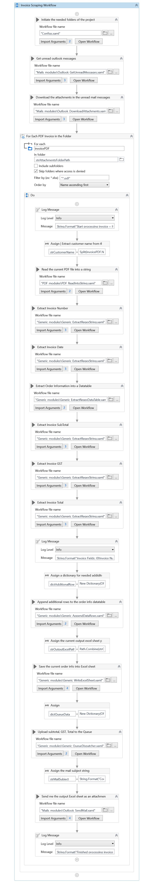

### Configs Workflow
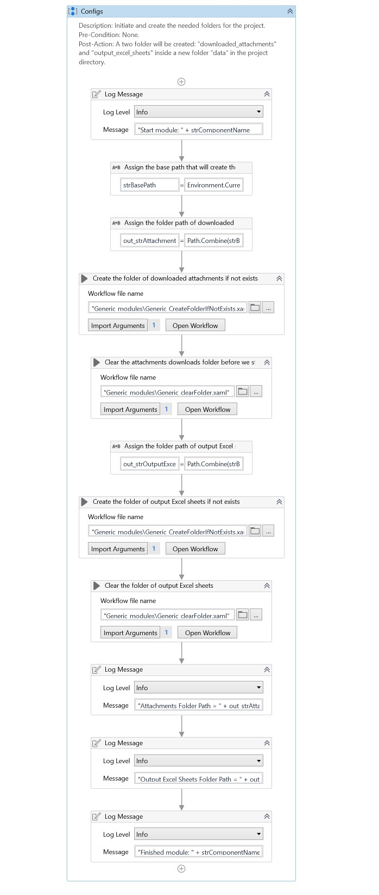

### Generic_AppendDataRows Workflow
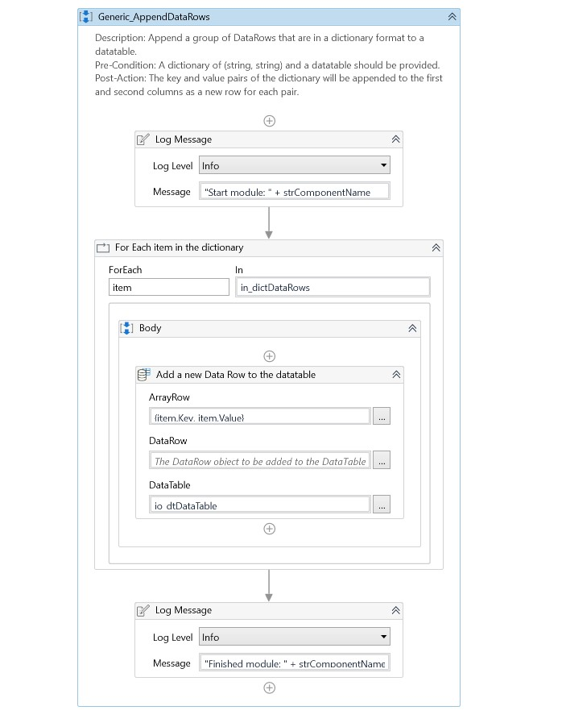

### Generic_clearFolder Workflow
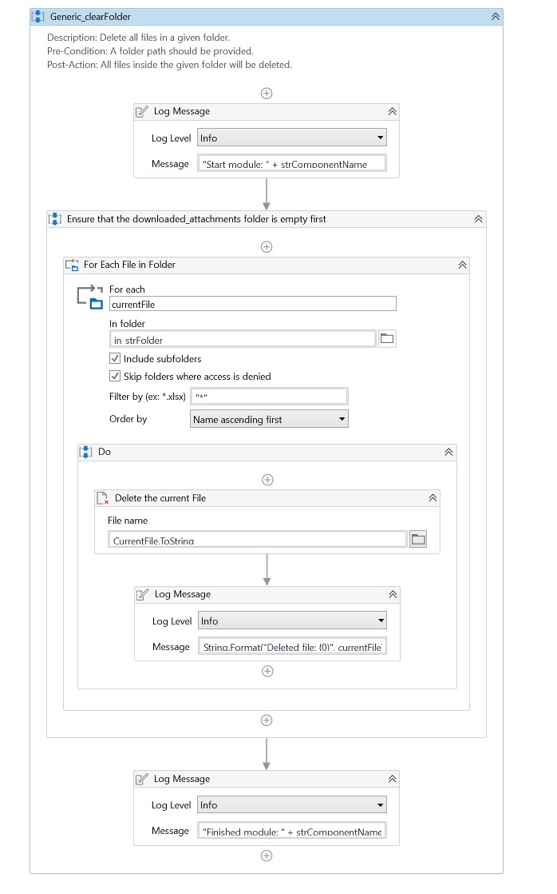

### Generic_CreateFolderIfNotExists Workflow
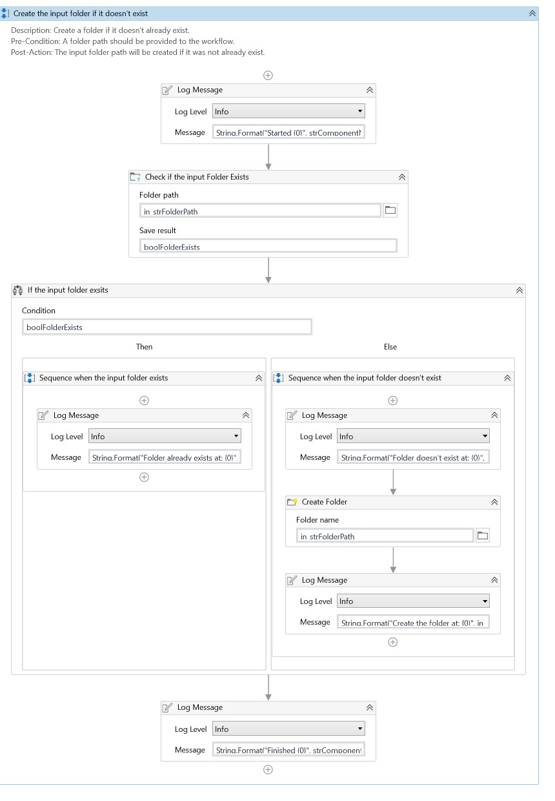
 
### Generic_ExtractRegexDataTable Workflow
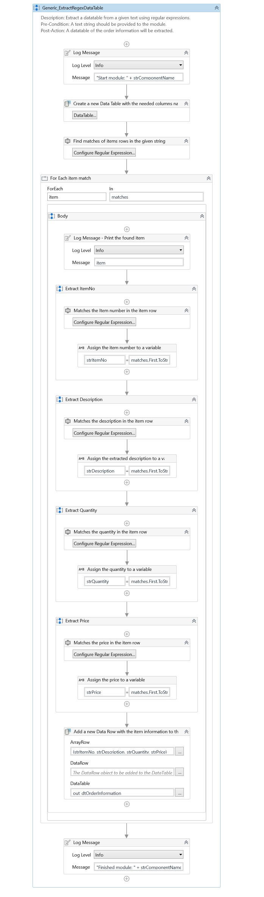

### Generic_ExtractRegexString Workflow

### Generic_WriteExcelSheet Workflow
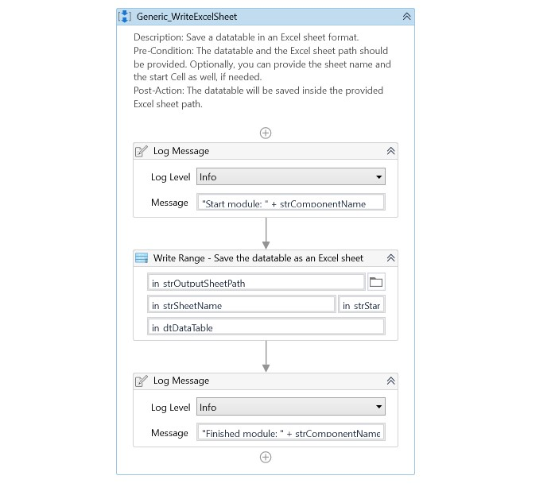

### Outlook_DownloadAttachments Workflow
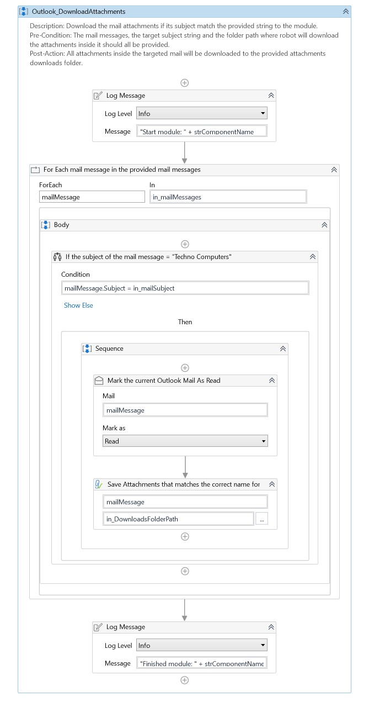

### Outlook_GetUnreadMessages Workflow
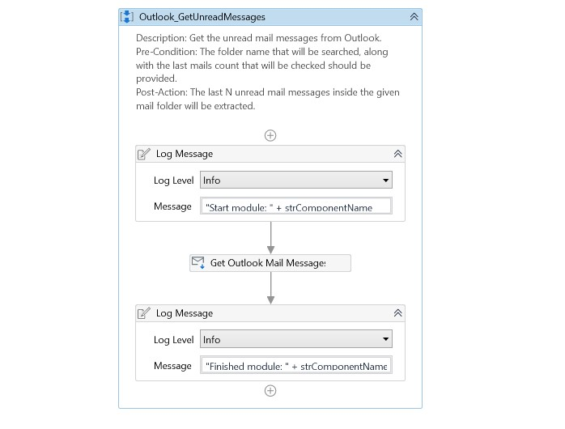

### Outlook_SendMail Workflow
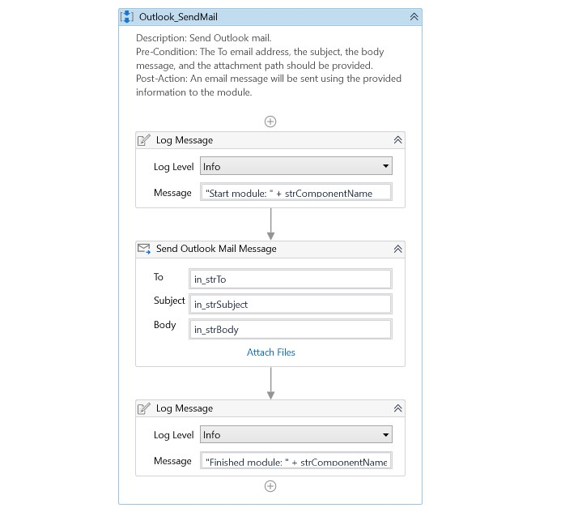

### PDF_ReadIntoString Workflow
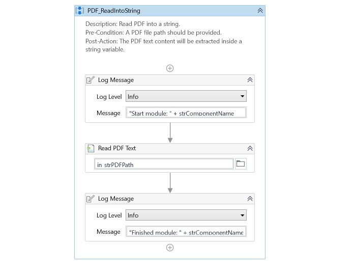

### Queue_Dispatcher Workflow
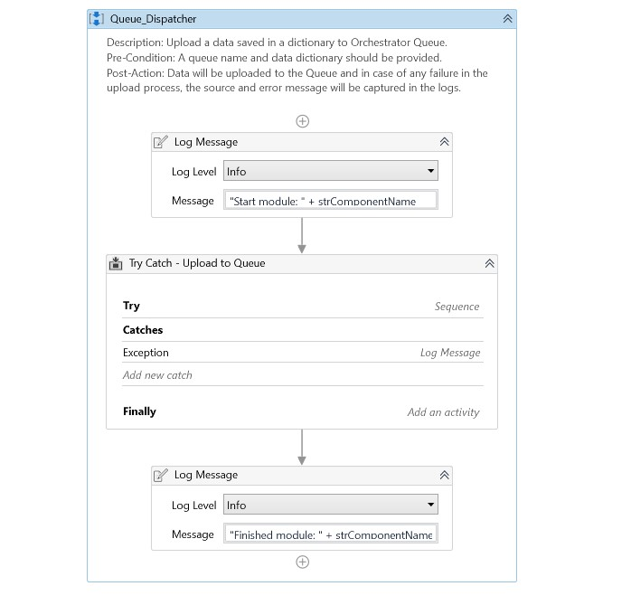

## About The Author

* Author: Mohamed Abdel-Gawad Ibrahim
* Contact: muhammadabdelgawwad@gmail.com
* Phone: +201069052620 || +201147821232
